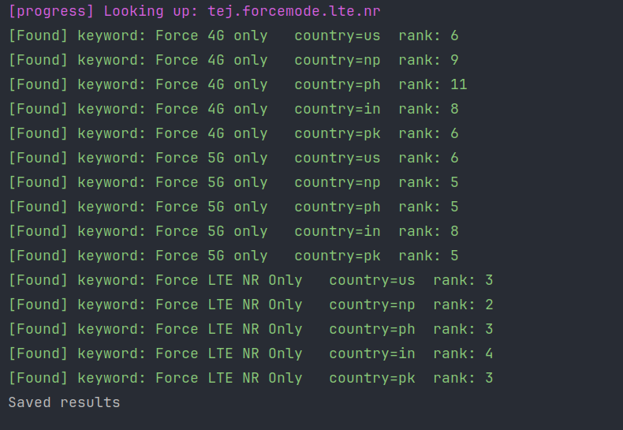

# App Rank tracker

Simple utility tool to track your app rankings in Google Play Store.

## Demo


## Usage guide

Clone this repository and create `tasks.json` file.

```json
[
  {
    "result_path": "results/force-5g-4g-only.json",
    "app_package_id": "tej.forcemode.lte.nr",
    "keywords": [
      "Force 4G only",
      "Force 5G only",
      "Force LTE NR Only"
    ],
    "countries": [
      "us",
      "np",
      "ph",
      "in",
      "pk"
    ]
  }
]
```

Now run the following command.

```bash
python3 -m venv .venv
source .venv/bin/activate

pip install -r requirements.txt

python run.py
```

The rank history will be saved in the `result_path` specified destination.