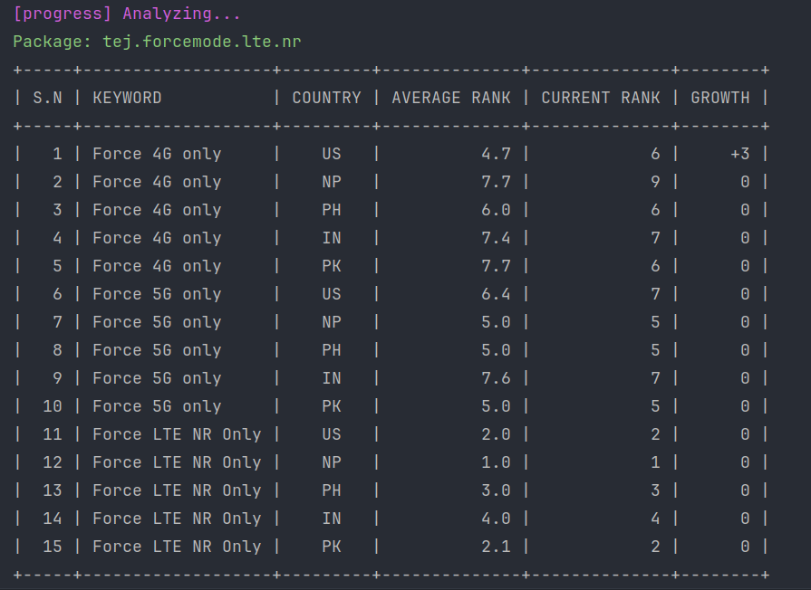

# App Rank tracker

Simple utility tool to track your app rankings in Google Play Store. Works with multiple variables such as by country,
keywords. Exports all your old app rankings as JSON.

## Demo


Result analysis



## Usage guide

Clone this repository and create `tasks.json` file.

```json
[
  {
    "result_path": "results/force-5g-4g-only.json",
    "app_package_id": "tej.forcemode.lte.nr",
    "keywords": [
      "Force 4G only",
      "Force 5G only",
      "Force LTE NR Only"
    ],
    "countries": [
      "us",
      "np",
      "ph",
      "in",
      "pk"
    ]
  }
]
```

Now run the following command.

```bash
# Create and active virtual environment
python3 -m venv .venv
source .venv/bin/activate

# Install dependencies
pip install -r requirements.txt

# Execute script. Make sure create tasks.json before executing.
python run.py
```

The rank history will be saved in the `result_path` specified destination.
The above command will also run the analyzer for `active` tasks.

## Running analyzer

The analyzer will print out all the rank progress regardless of active or inactive status.
But this will not fetch any new rankings. So, make sure to execute `run.py` for fresh data before running analyzer.

```bash
# Execute analyzer
python3 analyze.py
```